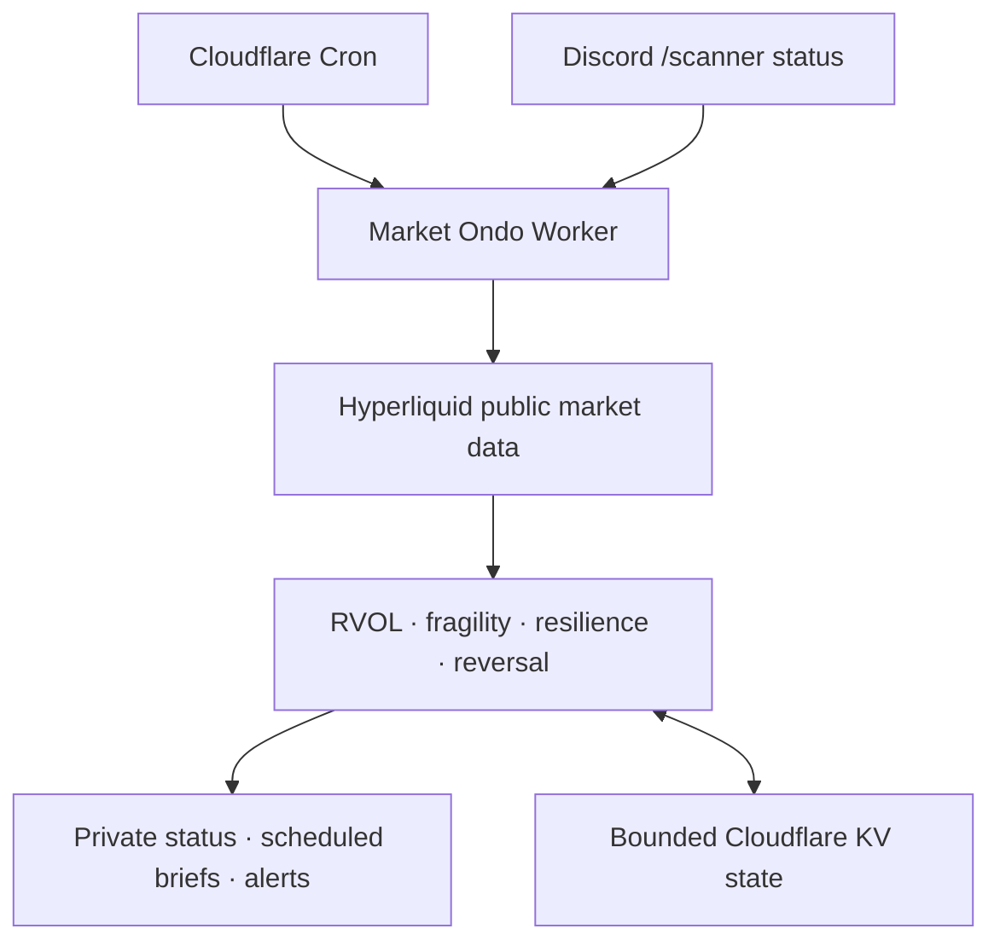

# Market Ondo · 시장 온도

[](https://github.com/obafgkm42/ondo/actions/workflows/ci.yml)

A lightweight market 온도 (_ondo_, “temperature”) monitor tracking activity,
fragility clusters, resilience, and reversal signals.

Market Ondo is a personal, read-only Cloudflare Worker for the Hyperliquid
`xyz:SP500` perpetual market. Its main job is to answer three practical
questions:

1. **Is today active enough to trade?** — same-time RVOL and recent volume
   bursts.
2. **Is market damage clustering or repairing?** — transparent
   `RESILIENT / FRAGILE / BREAKING / PANIC` classifications and their stressed
   mechanisms.
3. **Is recovery quality fading?** — bounded, prospective resilience telemetry.

The original convexity-reversal scanner remains available as a secondary,
frozen research feature. The Worker never places, modifies, or cancels orders.

> [!WARNING]
> **NFA — Not Financial Advice.** This is monitoring and research software, not
> investment or commodity-trading advice. `BREAKING`, `PANIC`, a bullish
> rejection candle, or any other label is not an instruction to short, buy the
> dip, or call a bottom. Backtests are hypothetical and do not establish a
> profitable strategy. Read [DISCLAIMER.md](DISCLAIMER.md).

The project is not affiliated with Hyperliquid, Discord, Cloudflare, any index
provider, the NFA, CFTC, or SEC.

## What Market Ondo shows

| Question | Diagnostic | Output | Can change trade alerts? |
| --- | --- | --- | --- |
| Is the session active? | Same-time cumulative and latest-slot RVOL | `DEADWATER`, `QUIET`, `NORMAL`, `ACTIVE`, `SURGE` | No |
| Is damage spreading? | Six repair mechanisms | `RESILIENT`, `FRAGILE`, `BREAKING`, `PANIC`, `UNKNOWN` | Only the frozen high-stress mention policy |
| Is recovery weakening? | Half-hour live resilience plus five-minute shadow path | `INSUFFICIENT_DATA`, `RESILIENT`, `FADING`, `FRAGILE` | No |
| Did price reject an extreme? | Frozen reversal rules | `WATCH` or `ALERT` | This is the retained alert feature |
| Can the inputs be trusted? | Freshness, continuity, and US cash-session calendar | `healthy`, `degraded`, `stale`, `unavailable` | Yes — unhealthy data withholds decisions |

These diagnostics describe different aspects of the same session. They are not
combined into an opaque probability or automatic trade recommendation.

## Data flow



The live Worker is TypeScript under `src/`. Reproducible local event studies
and backtests are Python under `python/reversal_scanner_backtest/`. Python
dependencies and generated reports are not part of the Worker runtime.

## 1. Market activity and RVOL

Market activity compares cumulative RTH volume with the same completed
15-minute slot in prior valid sessions:

| State | Cumulative same-time RVOL |
| --- | ---: |
| `DEADWATER` | `< 0.65` |
| `QUIET` | `0.65` to `< 0.85` |
| `NORMAL` | `0.85` to `< 1.20` |
| `ACTIVE` | `1.20` to `< 1.60` |
| `SURGE` | `>= 1.60` |

The latest 15-minute slot also reports an independent burst reading. A burst
does not override the cumulative session state. Percentiles begin after enough
same-slot history exists; missing candles never become fake low volume.

Only complete standard US equity sessions enter the durable baseline. NYSE
holidays and recurring early closes are excluded even if the 24/7 perpetual
continues trading. See
[Market activity and RVOL-at-time](docs/market-activity-methodology.md).

## 2. Fragility and repair mechanisms

Each due brief evaluates six explicit mechanisms:

1. current-session loss;
2. persistent displacement below VWAP;
3. poor latest-close location inside the observed range;
4. a volatility-adjusted cluster of large five-minute losses;
5. mega-cap stock-perpetual breadth; and
6. simultaneous weakness in `xyz:SP500` and `xyz:XYZ100`.

The frozen classification is count-based:

| Level | Stressed mechanisms |
| --- | ---: |
| `RESILIENT` | 0–1 |
| `FRAGILE` | 2 |
| `BREAKING` | 3 |
| `PANIC` | 4 or more |
| `UNKNOWN` | fewer than four mechanisms available |

The `0–100` stress score is a readable failure-count scale, not crash
probability. Expanded `xyz` stock breadth is context only and cannot become a
seventh mechanism. If cross-market metadata fails, the price-only brief remains
available and is labelled partial.

Scheduled `BREAKING` and `PANIC` briefs mention `@everyone` only when the data
is healthy and belongs to a standard RTH session. Shadow persistence records
whether damage is new, escalating, persistent, rotating, improving, recovered,
or relapsing. It never replaces the frozen classifier.

The rejected probability-v2 model is deliberately absent from the Worker: its
out-of-sample Brier Skill Score was negative. See
[Fragility v2 methodology](docs/fragility-v2-methodology.md) and the
[evaluation report](docs/fragility-v2-evaluation-report.md).

## 3. Resilience

Resilience tracks recovery after comparable drawdown shocks. The live path uses
a fixed half-hour grid. A separate five-minute shadow path collects prospective
observations under its own KV key and rejects shock starts too late to reach the
two-hour checkpoint before the cash close.

The shadow path:

- reuses candles already fetched for the scheduled scan;
- adds no Hyperliquid request;
- retains at most 78 current-session snapshots and 12 completed shocks;
- fails open if KV is unavailable or malformed; and
- cannot change messages, mentions, fragility, reversal rules, or thresholds.

Historical evaluation found the current `FADING` cohort too sparse for a
reliable strategy claim, so resilience remains presentation and research
telemetry. See
[Resilience decay methodology](docs/resilience-decay-methodology.md).

## 4. Retained reversal scanner

The original scanner detects fresh session extremes followed by a rejection
candle, bounded invalidation, sufficient underlying-price reward, and frozen
price-R and heuristic-score thresholds. `WATCH` is the earlier state; `ALERT`
keeps the stricter filter.


This remains an experimental feature rather than the product’s main purpose.
The current delivery-aware 2008–2026 study reports a full-sample profit factor
of `0.83`, rolling profit factor of `0.86`, and single-position profit factor of
`0.84` under the frozen stop policy. Those results do not validate a tradable
edge. In particular, a convex-looking rejection during a free-fall session is
not evidence that bottom-fishing is safe.

See [Current evidence](docs/current-evidence.md) and
[Backtest evaluation plan](docs/backtest-evaluation-plan.md).

## Data-health gate

Every scan checks the already-fetched candles for freshness, five-minute
continuity, session scope, and the supported US equity calendar. This adds no
provider request.

Stale, gapped, holiday, early-close, or overnight data may remain visible as
explicitly ineligible context, but it cannot:

- add fragility or resilience persistence;
- present RVOL as a live RTH input;
- route a reversal opportunity; or
- trigger `@everyone`.

Hyperliquid `xyz:SP500` is a venue-specific perpetual market, not official cash
SPX. Basis, funding, oracle, liquidity, and volume differences are possible.

## Running and deploying

Market Ondo runs as a single Cloudflare Worker driven by cron, with Discord
HTTP Interactions as its only interactive surface. Requirements are Node.js 22
or newer, Python 3.12, and `uv` for the research tooling.

```bash
npm ci
npm test
npm run typecheck
uv sync --dev
uv run pytest
```

Discord application setup, Cloudflare secrets and custom-domain configuration,
the scan/brief schedule and free-tier budget, the `off`/`shadow`/`display`
configuration modes, and local development are documented in
[Operating Market Ondo](docs/operations.md).

The offline event studies — reversal, fragility, the rejected v2 candidate,
the prospective KV snapshot report, and resilience decay — are documented in
[Offline research commands](docs/research-commands.md). The repository ships
only synthetic fixtures; bring lawfully obtained data and review its licence
before use.

## Research and safety contract

- Live labels are transparent diagnostics, not calibrated probabilities.
- The rejected probability candidate is not bundled into production.
- Shadow telemetry cannot silently promote itself into alerts or thresholds.
- Reversal research models delivery latency, expired entries, stops, slippage,
  costs, and session-cluster uncertainty.
- Parameter variants are reported for falsification, not automatically selected
  from the inspected historical sample.
- Public, paid, personalized, or account-linked distribution can create legal
  and platform obligations beyond this private research deployment.

## Working in this repository

Use a pull request as the normal unit of planning, implementation, and review;
separate intent, spec, plan, and review files are not required. Higher-risk
changes still need explicit evidence and approval where the research contract
requires it. See [Contributing](CONTRIBUTING.md) for the workflow,
[AGENTS.md](AGENTS.md) for the invariants an agent must not break, and the
[backtest evaluation plan](docs/backtest-evaluation-plan.md) for promotion
gates.

## Documentation

[docs/README.md](docs/README.md) is the full documentation map. The usual
starting points:

- [Roadmap](ROADMAP.md) — milestones, evidence boundary, and open queue
- [Current evidence](docs/current-evidence.md) — what the studies actually show
- [Contributing](CONTRIBUTING.md) — lightweight workflow and review checklist
- [Operating Market Ondo](docs/operations.md) — setup, deployment, and schedule
- [Disclaimer](DISCLAIMER.md) and [Compliance notes](COMPLIANCE.md) — limits and boundaries

The MIT License covers this repository’s original code and documentation. It
does not grant rights to third-party market data, service marks, APIs, or
datasets.
