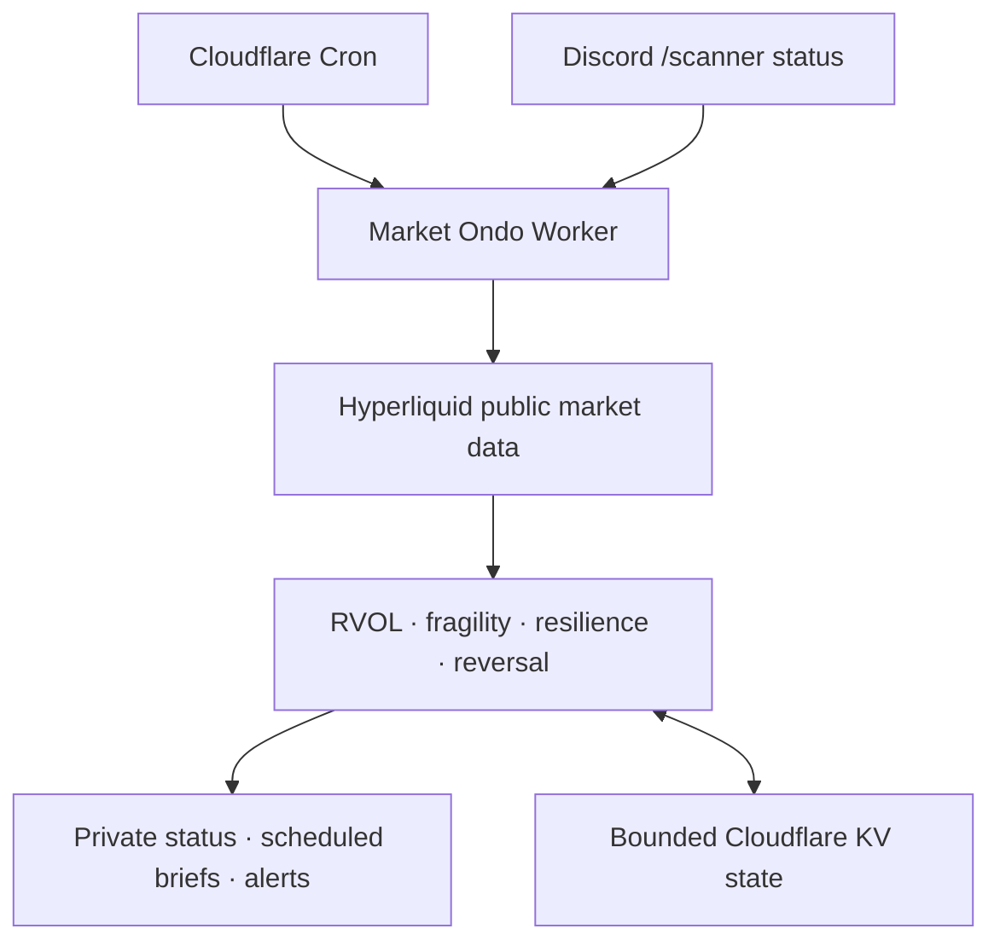

# Market Ondo · 시장 온도

[](https://github.com/obafgkm42/ondo/actions/workflows/ci.yml)

A lightweight market 온도 (_ondo_, “temperature”) monitor tracking activity,
fragility clusters, resilience, and reversal signals.

Market Ondo is a personal, read-only Cloudflare Worker for the Hyperliquid
`xyz:SP500` perpetual market. Its main job is to answer three practical
questions:

1. **Is today active enough to trade?** — same-time RVOL and recent volume
   bursts.
2. **Is market damage clustering or repairing?** — transparent
   `RESILIENT / FRAGILE / BREAKING / PANIC` classifications and their stressed
   mechanisms.
3. **Is recovery quality fading?** — bounded, prospective resilience telemetry.

The original convexity-reversal scanner remains available as a secondary,
frozen research feature. The Worker never places, modifies, or cancels orders.

> [!WARNING]
> **NFA — Not Financial Advice.** This is monitoring and research software, not
> investment or commodity-trading advice. `BREAKING`, `PANIC`, a bullish
> rejection candle, or any other label is not an instruction to short, buy the
> dip, or call a bottom. Backtests are hypothetical and do not establish a
> profitable strategy. Read [DISCLAIMER.md](DISCLAIMER.md).

The project is not affiliated with Hyperliquid, Discord, Cloudflare, any index
provider, the NFA, CFTC, or SEC.

## What Market Ondo shows

| Question | Diagnostic | Output | Can change trade alerts? |
| --- | --- | --- | --- |
| Is the session active? | Same-time cumulative and latest-slot RVOL | `DEADWATER`, `QUIET`, `NORMAL`, `ACTIVE`, `SURGE` | No |
| Is damage spreading? | Six repair mechanisms | `RESILIENT`, `FRAGILE`, `BREAKING`, `PANIC`, `UNKNOWN` | Only the frozen high-stress mention policy |
| Is recovery weakening? | Half-hour live resilience plus five-minute shadow path | `INSUFFICIENT_DATA`, `RESILIENT`, `FADING`, `FRAGILE` | No |
| Did price reject an extreme? | Frozen reversal rules | `WATCH` or `ALERT` | This is the retained alert feature |
| Can the inputs be trusted? | Freshness, continuity, and US cash-session calendar | `healthy`, `degraded`, `stale`, `unavailable` | Yes — unhealthy data withholds decisions |

These diagnostics describe different aspects of the same session. They are not
combined into an opaque probability or automatic trade recommendation.

## Data flow



The live Worker is TypeScript under `src/`. Reproducible local event studies
and backtests are Python under `python/reversal_scanner_backtest/`. Python
dependencies and generated reports are not part of the Worker runtime.

## 1. Market activity and RVOL

Market activity compares cumulative RTH volume with the same completed
15-minute slot in prior valid sessions:

| State | Cumulative same-time RVOL |
| --- | ---: |
| `DEADWATER` | `< 0.65` |
| `QUIET` | `0.65` to `< 0.85` |
| `NORMAL` | `0.85` to `< 1.20` |
| `ACTIVE` | `1.20` to `< 1.60` |
| `SURGE` | `>= 1.60` |

The latest 15-minute slot also reports an independent burst reading. A burst
does not override the cumulative session state. Percentiles begin after enough
same-slot history exists; missing candles never become fake low volume.

Only complete standard US equity sessions enter the durable baseline. NYSE
holidays and recurring early closes are excluded even if the 24/7 perpetual
continues trading. See
[Market activity and RVOL-at-time](docs/market-activity-methodology.md).

## 2. Fragility and repair mechanisms

Each due brief evaluates six explicit mechanisms:

1. current-session loss;
2. persistent displacement below VWAP;
3. poor latest-close location inside the observed range;
4. a volatility-adjusted cluster of large five-minute losses;
5. mega-cap stock-perpetual breadth; and
6. simultaneous weakness in `xyz:SP500` and `xyz:XYZ100`.

The frozen classification is count-based:

| Level | Stressed mechanisms |
| --- | ---: |
| `RESILIENT` | 0–1 |
| `FRAGILE` | 2 |
| `BREAKING` | 3 |
| `PANIC` | 4 or more |
| `UNKNOWN` | fewer than four mechanisms available |

The `0–100` stress score is a readable failure-count scale, not crash
probability. Expanded `xyz` stock breadth is context only and cannot become a
seventh mechanism. If cross-market metadata fails, the price-only brief remains
available and is labelled partial.

Scheduled `BREAKING` and `PANIC` briefs mention `@everyone` only when the data
is healthy and belongs to a standard RTH session. Shadow persistence records
whether damage is new, escalating, persistent, rotating, improving, recovered,
or relapsing. It never replaces the frozen classifier.

The rejected probability-v2 model is deliberately absent from the Worker: its
out-of-sample Brier Skill Score was negative. See
[Fragility v2 methodology](docs/fragility-v2-methodology.md) and the
[evaluation report](docs/fragility-v2-evaluation-report.md).

## 3. Resilience

Resilience tracks recovery after comparable drawdown shocks. The live path uses
a fixed half-hour grid. A separate five-minute shadow path collects prospective
observations under its own KV key and rejects shock starts too late to reach the
two-hour checkpoint before the cash close.

The shadow path:

- reuses candles already fetched for the scheduled scan;
- adds no Hyperliquid request;
- retains at most 78 current-session snapshots and 12 completed shocks;
- fails open if KV is unavailable or malformed; and
- cannot change messages, mentions, fragility, reversal rules, or thresholds.

Historical evaluation found the current `FADING` cohort too sparse for a
reliable strategy claim, so resilience remains presentation and research
telemetry. See
[Resilience decay methodology](docs/resilience-decay-methodology.md).

## 4. Retained reversal scanner

The original scanner detects fresh session extremes followed by a rejection
candle, bounded invalidation, sufficient underlying-price reward, and frozen
price-R and heuristic-score thresholds. `WATCH` is the earlier state; `ALERT`
keeps the stricter filter.


This remains an experimental feature rather than the product’s main purpose.
The current delivery-aware 2008–2026 study reports a full-sample profit factor
of `0.83`, rolling profit factor of `0.86`, and single-position profit factor of
`0.84` under the frozen stop policy. Those results do not validate a tradable
edge. In particular, a convex-looking rejection during a free-fall session is
not evidence that bottom-fishing is safe.

See [Current evidence](docs/current-evidence.md) and
[Backtest evaluation plan](docs/backtest-evaluation-plan.md).

## Data-health gate

Every scan checks the already-fetched candles for freshness, five-minute
continuity, session scope, and the supported US equity calendar. This adds no
provider request.

Stale, gapped, holiday, early-close, or overnight data may remain visible as
explicitly ineligible context, but it cannot:

- add fragility or resilience persistence;
- present RVOL as a live RTH input;
- route a reversal opportunity; or
- trigger `@everyone`.

Hyperliquid `xyz:SP500` is a venue-specific perpetual market, not official cash
SPX. Basis, funding, oracle, liquidity, and volume differences are possible.

## Primary interface: Discord

Market Ondo uses Discord HTTP Interactions. It does not maintain a Gateway
connection, read ordinary messages, request privileged intents, or place
orders. Responses to slash commands are ephemeral.

- `/scanner status` performs one live, read-only query and privately returns
  price, RVOL, fragility mechanisms, resilience, data coverage, and any retained
  reversal state.
- `/scanner repair` explains the six mechanisms and frozen level thresholds
  without requesting market data.
- `/scanner help` shows the private command guide.

Every interaction must have a valid Discord Ed25519 signature and match the
configured `DISCORD_GUILD_ID`.

### Discord setup

1. Create a Discord application and copy its Application ID and Public Key.
2. Store `DISCORD_APPLICATION_PUBLIC_KEY` and `DISCORD_GUILD_ID` as Cloudflare
   secrets.
3. Set the Developer Portal **Interactions Endpoint URL** to:

   ```text
   https://<your-custom-domain>/discord/interactions
   ```

4. Install the application with only the `applications.commands` scope.
5. Temporarily provide the Application ID, Guild ID, and Bot Token locally,
   then register the guild command:

   ```bash
   DISCORD_APPLICATION_ID=... \
   DISCORD_GUILD_ID=... \
   DISCORD_BOT_TOKEN=... \
   npm run discord:register
   ```

6. Unset the bot token. Use **Server Settings → Integrations** to grant the
   desired role or channel access; commands default to administrators.

Guild commands normally update immediately. Broad multi-server distribution is
out of scope for this personal deployment.

## Cloudflare deployment

The production interface uses a dashboard-managed Cloudflare Custom Domain.
`wrangler.toml` explicitly disables the two development surfaces so a Git-based
redeploy does not reopen them:

```toml
workers_dev = false
preview_urls = false
```

The custom hostname is intentionally not committed. It remains attached under
**Worker → Settings → Domains & Routes**, while the Discord endpoint uses that
hostname. The `name = "ondo"` entry in `wrangler.toml` matches the existing
Cloudflare Worker service identifier.

Public runtime defaults live in `wrangler.toml`. Secrets stay in Cloudflare:

```bash
npx wrangler secret put DISCORD_WEBHOOK_URL
npx wrangler secret put DISCORD_APPLICATION_PUBLIC_KEY
npx wrangler secret put DISCORD_GUILD_ID
```

`MANUAL_SCAN_TOKEN` is optional. Without it, the authenticated `/scan` endpoint
returns `404`; Discord `/scanner status` remains the normal on-demand interface.
To keep the emergency/manual endpoint, set it separately:

```bash
npx wrangler secret put MANUAL_SCAN_TOKEN
```

An ID-free `SCANNER_STATE` KV binding is declared in `wrangler.toml`. It stores
bounded RVOL history, failed-scan recovery, signal deduplication, diagnostic
shadow state, rate-limit incident state, and version notices. Do not commit an
account-specific namespace ID if Wrangler writes one into a local file.

After this repository is linked to the existing Cloudflare Worker, Cloudflare
builds deploy the latest main branch automatically. A manual deployment remains
available:

```bash
npm run deploy
```

## Schedule and free-tier discipline

Cloudflare invokes the Worker every five minutes, then the Worker applies its
own gate:

- normal scans every 15 minutes;
- scans every five minutes from 15:00–16:00 New York time;
- standard-session briefs every 30 minutes; and
- non-standard-session briefs no more frequently than hourly.

Each scheduled scan uses one Hyperliquid candle request and evaluates every new
five-minute candle since the previous allowed scan. A due brief adds one
`perpCategories` and one `metaAndAssetCtxs` request for fragility context. A
history-deficient RVOL installation may make one bounded 15-minute bootstrap
request after a deployment or during its post-close retry window.

The prospective diagnostics reuse those responses:

- fragility shadow: at most about 13 KV reads and writes per full RTH day;
- five-minute resilience shadow: about 35 KV reads and writes under the mixed
  production cadence, with a conservative 78-operation ceiling; and
- no extra Hyperliquid request for either shadow collector.

All durable collections are bounded. Provider, metadata, or KV failures fail
open and leave the core read-only monitor available. Current quota references
and the full resource contract live in the linked methodology documents rather
than being duplicated as assumptions here.

## Configuration modes

The repository deployment currently uses:

```toml
[vars]
LANGUAGE = "zh"
MARKET_ACTIVITY_MODE = "display"
FRAGILITY_PERSISTENCE_MODE = "shadow"
RESILIENCE_DECAY_SHADOW_MODE = "shadow"
```

- `MARKET_ACTIVITY_MODE`: `off`, `shadow`, or `display`;
- `FRAGILITY_PERSISTENCE_MODE`: `off`, `shadow`, or `display`;
- `RESILIENCE_DECAY_SHADOW_MODE`: `off` or `shadow`.

Parser defaults remain conservative even where this repository explicitly opts
into bounded collection or display. Conflicting legacy
`FRAGILITY_V2_MODE`/`FRAGILITY_PERSISTENCE_MODE` values fail configuration
loading.

## Local development

Requirements:

- Node.js 22 or newer;
- Python 3.12; and
- `uv` for research tooling.

```bash
npm ci
npm test
npm run typecheck
uv sync --dev
uv run pytest
```

Run the Worker locally:

```bash
npm run dev
```

Trigger the local scheduled handler:

```text
http://localhost:8787/cdn-cgi/handler/scheduled
```

Copy `.env.example` to `.dev.vars` for local bindings. Never commit real
webhook URLs, account IDs, bot tokens, or manual-scan tokens.

## Offline research commands

The repository contains only synthetic fixtures. Bring lawfully obtained data
and review its licence before use.

### Reversal event study

```bash
uv run reversal-scanner-backtest \
  --input tests/fixtures/synthetic-candles.json \
  --output backtest/smoke/reversal_backtest.json \
  --output-dir backtest/smoke \
  --replay-mode every-bar \
  --source-timezone UTC \
  --placebo-runs 0 \
  --bootstrap-runs 0
```

### Fragility event study and rejected v2 candidate

```bash
uv run fragility-backtest \
  --input path/to/SPX_full_5min_CT.json \
  --output-dir backtest/fragility-price-only-v1 \
  --source-timezone America/Chicago \
  --source-timestamp-mode naive-local

uv run fragility-v2-evaluate \
  --input-observations backtest/fragility-price-only-v1/events/fragility_observations.csv \
  --output-dir backtest/fragility-v2-shadow \
  --bootstrap-runs 1000
```

### Prospective fragility snapshot

One manual KV export can be analysed completely offline:

```bash
mkdir -p reports/generated
npx wrangler kv key get \
  "market-fragility-v2-shadow:xyz:SP500" \
  --binding SCANNER_STATE \
  --remote \
  --text > reports/generated/fragility-shadow-state.json

uv run fragility-shadow-report \
  --input-state reports/generated/fragility-shadow-state.json
```

The ignored report separates repeated brief counts from unique-session
prevalence. It is descriptive telemetry only. See
[Fragility shadow snapshot report](docs/fragility-shadow-report.md).

### Resilience event study

```bash
uv run resilience-decay-backtest \
  --input path/to/SPX_full_5min_CT.json \
  --output-dir backtest/resilience-decay-v1 \
  --source-timezone America/Chicago \
  --source-timestamp-mode naive-local \
  --session-timezone America/New_York
```

Generated `backtest/` and `reports/generated/` outputs are ignored by Git. The
TypeScript live path pins the shared `market-data-pipeline` revision in
`package.json`; canonical input contracts are documented in
[Market-data sources](docs/market-data-sources.md).

## Research and safety contract

- Live labels are transparent diagnostics, not calibrated probabilities.
- The rejected probability candidate is not bundled into production.
- Shadow telemetry cannot silently promote itself into alerts or thresholds.
- Reversal research models delivery latency, expired entries, stops, slippage,
  costs, and session-cluster uncertainty.
- Parameter variants are reported for falsification, not automatically selected
  from the inspected historical sample.
- Public, paid, personalized, or account-linked distribution can create legal
  and platform obligations beyond this private research deployment.

## Documentation

- [Roadmap](ROADMAP.md)
- [Current evidence](docs/current-evidence.md)
- [Market activity methodology](docs/market-activity-methodology.md)
- [Fragility backtest methodology](docs/fragility-backtest-methodology.md)
- [Fragility v2 methodology](docs/fragility-v2-methodology.md)
- [Fragility v2 evaluation](docs/fragility-v2-evaluation-report.md)
- [Fragility shadow snapshot report](docs/fragility-shadow-report.md)
- [Resilience decay methodology](docs/resilience-decay-methodology.md)
- [Backtest evaluation plan](docs/backtest-evaluation-plan.md)
- [Disclaimer](DISCLAIMER.md)
- [Compliance notes](COMPLIANCE.md)
- [Security policy](SECURITY.md)
- [Third-party notices](THIRD_PARTY_NOTICES.md)
- [Contributing](CONTRIBUTING.md)
- [MIT License](LICENSE)

The MIT License covers this repository’s original code and documentation. It
does not grant rights to third-party market data, service marks, APIs, or
datasets.
