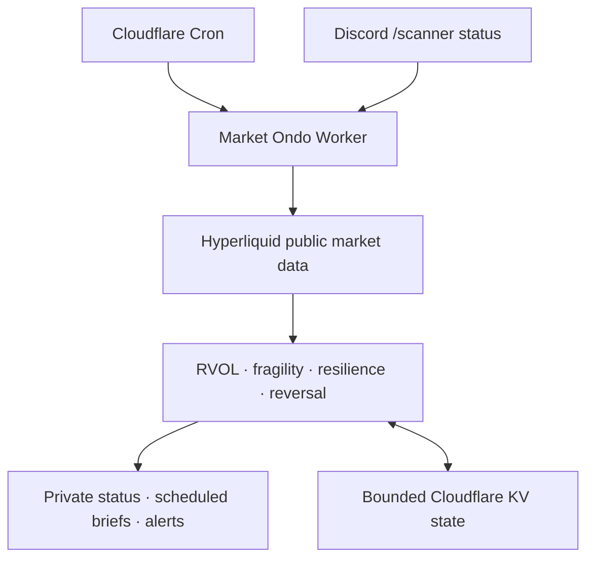

# Market Ondo · 시장 온도

[](https://github.com/obafgkm42/ondo/actions/workflows/ci.yml)

A lightweight market 온도 (_ondo_, “temperature”) monitor tracking activity,
fragility clusters, resilience, and reversal signals.

Market Ondo is a personal, read-only Cloudflare Worker for the Hyperliquid
`xyz:SP500` perpetual market. Its main job is to answer three practical
questions:

1. **Is today active enough to trade?** — same-time RVOL and recent volume
   bursts.
2. **Is market damage clustering or repairing?** — transparent
   `RESILIENT / FRAGILE / BREAKING / PANIC` classifications and their stressed
   mechanisms.
3. **Is recovery quality fading?** — bounded, prospective resilience telemetry.

The original convexity-reversal scanner remains available as a secondary,
frozen research feature. The Worker never places, modifies, or cancels orders.

> [!WARNING]
> **NFA — Not Financial Advice.** This is monitoring and research software, not
> investment or commodity-trading advice. `BREAKING`, `PANIC`, a bullish
> rejection candle, or any other label is not an instruction to short, buy the
> dip, or call a bottom. Backtests are hypothetical and do not establish a
> profitable strategy. Read the [disclaimer](docs/policies/disclaimer.md).

The project is not affiliated with Hyperliquid, Discord, Cloudflare, any index
provider, the NFA, CFTC, or SEC.

## What Market Ondo shows

| Question | Diagnostic | Output | Can change trade alerts? |
| --- | --- | --- | --- |
| Is the session active? | Same-time cumulative and latest-slot RVOL | `DEADWATER`, `QUIET`, `NORMAL`, `ACTIVE`, `SURGE` | No |
| Is damage spreading? | Six repair mechanisms | `RESILIENT`, `FRAGILE`, `BREAKING`, `PANIC`, `UNKNOWN` | Only the frozen high-stress mention policy |
| Is recovery weakening? | Half-hour live resilience plus five-minute shadow path | `INSUFFICIENT_DATA`, `RESILIENT`, `FADING`, `FRAGILE` | No |
| Did price reject an extreme? | Frozen reversal rules | `WATCH` or `ALERT` | This is the retained alert feature |
| Can the inputs be trusted? | Freshness, continuity, and US cash-session calendar | `healthy`, `degraded`, `stale`, `unavailable` | Yes — unhealthy data withholds decisions |

These diagnostics describe different aspects of the same session. They are not
combined into an opaque probability or automatic trade recommendation.

## Data flow


```mermaid
flowchart TD
    Cron["Cloudflare Cron"] --> Worker["Market Ondo Worker"]
    Command["Discord /scanner status"] --> Worker
    Worker --> Data["Hyperliquid public market data"]
    Data --> Diagnostics["RVOL · fragility · resilience · reversal"]
    Diagnostics --> Discord["Private status · scheduled briefs · alerts"]
    Diagnostics <--> KV["Bounded Cloudflare KV state"]
```

The live Worker is TypeScript under `src/`. Reproducible local event studies
and backtests are Python under `python/reversal_scanner_backtest/`. Python
dependencies and generated reports are not part of the Worker runtime.

## Reading the diagnostics

**Market activity** compares cumulative regular-session volume with the same
completed 15-minute slot in prior valid sessions. The latest-slot burst is
independent of the session label. Missing candles never become low volume;
only complete standard US equity sessions enter the baseline. See the
[RVOL measurement contract](docs/methodology/market-activity-methodology.md).

**Fragility** counts six stressed repair mechanisms: session loss, VWAP repair,
close location, downside tails, mega-cap breadth and cross-index confirmation.
These are correlated diagnostics, not independent probabilities. The score,
coverage and transition rules are defined in the
[fragility contract](docs/methodology/fragility-backtest-methodology.md).

**Resilience** measures recovery after drawdowns using bounded prospective
history. Half-hour live state and five-minute shadow observations remain
separate. See the
[resilience contract](docs/methodology/resilience-decay-methodology.md).

**Reversal signals** retain the frozen WATCH/ALERT rules and asymmetric bullish
reversal / bearish crash-monitor policy. They do not model option fills or
Greeks. See the [evaluation protocol](docs/methodology/backtest-evaluation-plan.md)
and [synthetic candle examples](docs/assets/reversal-signal-candle-examples.svg).

**Data health** gates decisions and mentions. Missing, stale, gapped or
ineligible session data must remain labelled; the monitor can still show a
partial brief. Diagnostics do not promote themselves from shadow to live.
The [runtime guide](docs/operations/runtime.md) defines schedules and modes;
[current evidence](docs/evidence/current-evidence.md) records the findings,
including negative results and the rejected probability-v2 model.

## Running and deploying

Market Ondo runs as a single Cloudflare Worker driven by cron, with Discord
HTTP Interactions as its only interactive surface. Requirements are Node.js 22
or newer, Python 3.12, and `uv` for the research tooling.

```bash
npm ci
npm test
npm run typecheck
uv sync --dev
uv run pytest
```

Discord application setup, Cloudflare secrets and custom-domain configuration,
the scan/brief schedule and free-tier budget, the `off`/`shadow`/`display`
configuration modes, and local development are documented in
[Operating Market Ondo](docs/operations/runtime.md).

The offline event studies — reversal, fragility, the rejected v2 candidate,
the prospective KV snapshot report, and resilience decay — are documented in
[Offline research commands](docs/research/commands.md). The repository ships
only synthetic fixtures; bring lawfully obtained data and review its licence
before use.

## Research and safety contract

- Live labels are transparent diagnostics, not calibrated probabilities.
- The rejected probability candidate is not bundled into production.
- Shadow telemetry cannot silently promote itself into alerts or thresholds.
- Reversal research models delivery latency, expired entries, stops, slippage,
  costs, and session-cluster uncertainty.
- Parameter variants are reported for falsification, not automatically selected
  from the inspected historical sample.
- Public, paid, personalized, or account-linked distribution can create legal
  and platform obligations beyond this private research deployment.

## Working in this repository

Use a pull request as the normal unit of planning, implementation, and review;
separate intent, spec, plan, and review files are not required. Higher-risk
changes still need explicit evidence and approval where the research contract
requires it. See [Contributing](CONTRIBUTING.md) for the workflow,
[AGENTS.md](AGENTS.md) for the invariants an agent must not break, and the
[backtest evaluation plan](docs/methodology/backtest-evaluation-plan.md) for
promotion gates.

## Documentation

[docs/README.md](docs/README.md) is the full documentation map. The usual
starting points:

- [Roadmap](docs/planning/roadmap.md) — milestones, evidence boundary, and open
  queue
- [Current evidence](docs/evidence/current-evidence.md) — what the studies
  actually show
- [Contributing](CONTRIBUTING.md) — lightweight workflow and review checklist
- [Operating Market Ondo](docs/operations/runtime.md) — setup, deployment, and
  schedule
- [Disclaimer](docs/policies/disclaimer.md) and
  [Compliance notes](docs/policies/compliance.md) — limits and boundaries

The MIT License covers this repository’s original code and documentation. It
does not grant rights to third-party market data, service marks, APIs, or
datasets.

[candle-examples]: docs/assets/reversal-signal-candle-examples.svg
